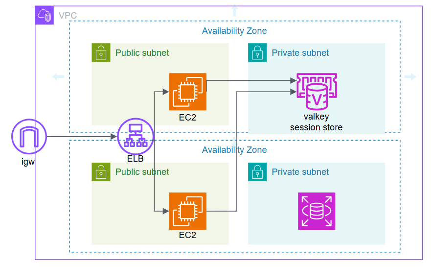

# 【AWS】 VPC + EC2 構築

AWS入門として、VPC + EC2を無料枠で構築して、クライアント端末からSSH接続する方法。


## 参考サイト
事前に参考サイトを読んでおくと理解しやすい
> [!NOTE]
>
> 無料枠について  
> https://zenn.dev/khirasan/articles/2d13b313f09a07  
>
> アカウント登録の流れ  
> https://aws.amazon.com/jp/register-flow/  
> 
> IAM作成  
> https://qiita.com/shihandai/items/899c2ab8119783492349  
> 
> EC2  
> https://zenn.dev/mi_01_24fu/articles/aws-ec2-2024_08_07  
> https://qiita.com/Yasushi-Mo/items/c87fa189db431d9e6f22  
> https://liginc.co.jp/651742  

## ネットワーク構築の流れ

以下を参考にして、ネットワークの構築を進めていく

【AWS①】ネットワークを構築してみる  
https://zenn.dev/oreo2990/articles/bf3112bb6ccb48  

> [!NOTE]
> ## 使用するIPアドレスについて
> 
> 以下の`VPC`と`PUBLIC-SUBNET-1`のCIDRを使用する
> 
> - VPC              : CIDR=`10.0.0.0/16` 65,536個のIP
> - PUBLIC-SUBNET-1  : CIDR=`10.0.1.0/24`    256個のIP
> - PUBLIC-SUBNET-2  : CIDR=`10.0.2.0/24`    256個のIP  ※今回は使用しない
> - PRIVATE-SUBNET-3 : CIDR=`10.0.3.0/24`    256個のIP  ※今回は使用しない
> - PRIVATE-SUBNET-4 : CIDR=`10.0.4.0/24`    256個のIP  ※今回は使用しない

## VPCの作成

- 「VPCのみ」で作成する
- 「IPv4 CIDRブロック」は上記にも記載した`10.0.0.0/16`とする
- 「IPv6 CIDRブロック」は使用しないため、`なし`
- 「テナンシー」は無償の`デフォルト`

## インターネットゲートウェイの作成

- インターネットゲートウェイを１つ新規作成する
- 作成後に表示されるダイアログに従って、今回作成した`VPC`に`igw`をアタッチする
  ※igw=インターネットゲートウェイ

## ルートテーブルのルート編集

- `VPC`のルートテーブルに`igw`を追加設定する
  - 送信先は`0.0.0.0/0`を設定する
  - ターゲットは今回作成した`igw`を設定する

> [!TIP]
> - igwが設定されているルートテーブルを使用するサブネットを`PUBLIC SUBNET`と呼ぶ
> - 別途作成したルートテーブルでigwが設定されていないルートテーブルを使用するサブネットを`PRIVATE SUBNET`と呼ぶ

## サブネットの作成

> [!NOTE]
> ## 使用するAZについて
> 
> 以下の`PUBLIC-SUBNET-1`にAZを一つ選択する  
> `PUBLIC-SUBNET-1`と`PUBLIC-SUBNET-2`を作成する場合には異なるAZを選択すること  
> 
> - PUBLIC-SUBNET-1  : 例=`ap-northeast-1a`
> - PUBLIC-SUBNET-2  : 例=`ap-northeast-1b`  ※今回は使用しない
> - PRIVATE-SUBNET-3 : 例=`ap-northeast-1a`  ※今回は使用しない
> - PRIVATE-SUBNET-4 : 例=`ap-northeast-1b`  ※今回は使用しない

- 今回作成したVPCを選択する
- AZは上記の考え方に従って１つ選択する
- `PUBLIC-SUBNET-1`に設定するIPv4 subnet CICR blockは上記に従い`10.0.1.0/24`とする

## ルートテーブルのサブネットへの関連付け

- 作成したサブネットを開き、作成したルートテーブルを関連付ける。
  - デフォルトのルートテーブルが設定されているため、関連付けの変更が必要。

## ACL

すべて許可(デフォルトのまま)

## セキュリティグループの作成

- セキュリティグループを1つ新規作成する
- インバウンドルールは、デフォルトのインバウンド設定（すべて許可）は全て削除して、許可するべきポートのみを開放する  
  今回は「タイプ=`SSH`、ソース=`マイIP`」というインバウンドルールを1つ追加する
- アウトバウンドルールは、すべて許可とする

> [!NOTE]
> - 例えば、自宅マシンから作業用にインバウンドでSSH（22番ポート）を許可する
>   - ⇒「タイプ=`SSH`、ソース=`マイIP`」
> - 例えば、自宅マシンから動作確認用にインバウンドで8080番ポートを許可する
>   - ⇒「タイプ=`カスタムTCP`、ポート範囲=`8080`、ソース=`マイIP`」
> - 例えば、スマホから動作確認用にインバウンドで8080番ポートを許可する
>   - ⇒「タイプ=`カスタムTCP`、ポート範囲=`8080`、ソース=`0.0.0.0/0`」

> [!NOTE]
> ## サブネットへの配置の例
> 
> - 例えば、PUBLIC  SUBNETには、API GW、ALB、WEBサーバ、踏み台サーバ、etcを配置する
> - 例えば、PRIVATE SUBNETには、DB、EC2内部サーバ（APサーバ、バッチサーバ）、ECS（サービス、タスク）、etcを配置する

## EC2インスタンス構築の流れ

以下を参考にして、EC2インスタンスの構築を進めていく

【AWS】EC2インスタンスの作成方法解説！サーバーを作成して接続してみる  
https://engineer-ninaritai.com/aws-ec2-make/  

> [!NOTE]
> 以下が要点
> - VPCを選択
> - SUBNETを選択
> - セキュリティグループを選択
> - OSはAmazonLinuxを選択
> - マシンイメージは無料枠の対象を選択
> - インスタンスタイプ ※1年間無料枠
> - ストレージ　 ※1年間無料枠
> - キーペアを新規作成　※一度しかダウンロードできないため紛失はNG。紛失したら別に作成。

## SSH接続の方法  

```
EC2インスタンスのダッシュボードより、「パブリック IPv4 アドレス」を確認し、
'key.pem'を配置したフォルダでコマンドプロンプトを開き、以下コマンドを実行する

ssh -i key.pem ec2-user@パブリックIPアドレス
```

## Spring-bootアプリケーションの起動確認

```
sudo yum install -y git
sudo yum install -y java-21-amazon-corretto-headless.x86_64
git clone https://github.com/namickey/spring-boot3-try.git
cd spring-boot3-try
./mvnw spring-boot:run
```

## ブラウザからアクセス
`http://パブリックIPアドレス:8080/`

パブリックIPは、EC2インスタンスのダッシュボードから確認すること


## 動作確認後は、EC2インスタンス停止、VPC削除を行う

- EC2インスタンスを終了する
- 作成したネットワーク関連を全て削除する

## やってみよう

1. AWSアカウントを作成する　※メールアドレスとクレジットカードが必要
1. 本手順に従って、VPC及びEC2インスタンスの作成を行い、アプリケーションを起動する
1. EC2インスタンス終了し、VPCを削除する

> [!TIP]
> ## 例：PUBLIC SUBNETへ作成するEC2インスタンス
> 
> - OSは、`Amazon Linux 2`
> - インスタンスタイプは、t2.micro
> - VPCは、1つ固定
> - サブネットは、`PUBLIC SUBNET`の1 or 2 ※サブネットが使用するルートテーブルにigwが設定済み
> - Public IPを付与する
> - Elastic IPは付与しなくてよい
> - ストレージは8GB
> - セキュリティグループは、PUBLIC向けでSSHを許可。インターネットからアクセスがあるため送信元IPはできるだけ限定する。
> - アクセス方法は、例えば自宅マシンからSSHする。
> 
> ## 例：PRIVATE SUBNETへ作成するEC2インスタンス
> 
> - OSは、`Amazon Linux 2`
> - インスタンスタイプは、t2.micro
> - VPCは、1つ固定
> - サブネットは、`PRIVATE SUBNET`の1 or 2 ※サブネットが使用するルートテーブルにigwは設定しない
> - Public IPは無し
> - Elastic IPは無し
> - ストレージは8GB
> - セキュリティグループは、PRIVATE向けでSSHを許可。送信元はPUBLICのセキュリティグループを指定。
> - アクセス方法は、例えば、まず自宅マシンからPUBLIC SUBNETのEC2へSSHして、次にそのEC2内からPRIVATE SUBNETのEC2へSSHする。  
>   ※PUBLIC側EC2を`踏み台`と呼ぶ
> 
> ## 外部から踏み台を経由したPRIVATE SUBNET内のEC2インスタンスへのSSH接続方法  
> ```
> PUBインスタンスへPRIインスタンス用のkey.pemを転送する
> 自宅マシン > scp -i pub-key.pem pri-key.pem ec2-user@publicIPアドレス（PUBLIC側EC2）:~/
> 
> PUBインスタンスへSSH接続する
> 自宅マシン > ssh -i pub-key.pem ec2-user@IPアドレス（PUBLIC側EC2）
> 
> PUBインスタンス内で、転送したPRIインスタンス用のkeyのパーティションを変更する
> PUBLIC側EC2 > chmod 400 pri-key.pem
> 
> PUBインスタンス内から、PRIインスタンスへSSH接続する
> PUBLIC側EC2 > ssh -i key.pem privateIPアドレス（PRIVATE型EC2）
> ```

> [!NOTE]
> ## 参考：AWSの無料枠の抜粋
> 
> - ネットワーク
>   - 無し：VPC
>   - 無し：SUBNET
>   - 無し：ルートテーブル
>   - 無し：インターネットゲートウェイ
>   - 無し：ACL
>   - 無し：セキュリティグループ
>   - 無料：通信（外⇒AWS）
>   - 無料枠：通信（AWS⇒外）
>   - 無料：通信（同一AZ内）
>   - `有料`：通信（異なるAZ間）
> - EC2
>   - 有料：Public IPv4
>   - `有料`：Elastic IP
>   - 無料枠：EC2インスタンス
>   - 無料枠：ELB（ストレージ）
> 
> - WEB API
>   - 無料枠：API Gateway
> - CloudWatch
>   - 無料枠：CloudWatch Logs
> - ストレージ
>   - 無料枠：S3
> - データベース
>   - 無料枠：RDS
>   - `有料`：Aurora
> - コンテナ
>   - `有料`：ECS, Fargate
>   - 無料枠：ECR
> - ネットワーク
>   - 無料枠：ALB
>   - `有料`：NATゲートウェイ
>   - `有料`：ECR VPCエンドポイント
>   - `有料`：CloudWatch VPCエンドポイント
>   - 無料：S3 VPCエンドポイント
>   - 無料：ACM
>   - `有料`：ROUTE53
> - その他
>   - `有料`：Secrets Manager

> [!NOTE]
> 2024年2月1日以降、AWSのパブリックIPv4に料金が発生する  
> https://zenn.dev/not75743/scraps/7c2117d86dfe37  
> EC2 Instance Connectを使用してプライベートなEC2へ接続する  
> https://zenn.dev/not75743/articles/c139dc1e99f790  

> [!NOTE]
> ## 参考：PRIVATE SUBNETを使うなら、`NATゲートウェイ`or`VPCエンドポイント`が必要
> 
> EC2】プライベートサブネットでyumコマンドを通すために「S3エンドポイント」を設定する  
> https://soypocket.com/it/ec2-yum-privatesubnet-s3endpoint/  
> 
> そのトラフィック、NATゲートウェイを通す必要ありますか？適切な経路で不要なデータ処理料金は削減しましょう  
> https://dev.classmethod.jp/articles/reduce-unnecessary-costs-for-nat-gateway/  
> 
> ECS+fargate+プライベートサブネットでコンテナを立ててアクセスする  
> https://blog.not75743.com/post/ecs_private/  
> 
> - NATゲートウェイ無し：PRIVATE SUBNETに配置されたEC2からインターネットアクセスできない。`yum update`もできない。ECRからpullできない。S3もCloud Watchもダメ。
> - NATゲートウェイ有り：PRIVATE SUBNETに配置されたEC2からインターネットアクセスできる。有料で高い。
> 
> - VPCエンドポイント無し：PRIVATE SUBNETに配置されたEC2からインターネットアクセスできない。`yum update`もできない。ECRからpullできない。S3もCloud Watchもダメ。
> - VPCエンドポイント有り：PRIVATE SUBNETに配置されたEC2からインターネットアクセスできない。`yum update`もできない。> ECR、S3、Cloud Watchは使えるようになる。


# 【AWS】Spring-boot + ELB + Elasticache Redis for session store



## redis session store

pom.xml
```xml
		<dependency>
			<groupId>org.springframework.boot</groupId>
			<artifactId>spring-boot-starter-data-redis</artifactId>
		</dependency>
		<dependency>
			<groupId>org.springframework.session</groupId>
			<artifactId>spring-session-data-redis</artifactId>
		</dependency>
```

application.properties
```properties
spring.datasource.driver-class-name=org.postgresql.Driver
spring.datasource.url=jdbc:postgresql://localhost:5432/postgres
spring.datasource.username=postgres
spring.datasource.password=postgres
```

application-prod.properties
```properties
spring.session.store-type=redis
spring.data.redis.host=localhost
spring.data.redis.port=6379
spring.data.redis.timeout=5000
```

create ec2
```sh
#!/bin/bash
# jdk21 install
yum -y install java-21-amazon-corretto-headless.x86_64
# git install
yum -y install git
# clone
cd /home/ec2-user
sudo -u ec2-user git clone https://github.com/namickey/spring-boot3-train.git
# cd
cd /home/ec2-user/spring-boot3-train
# checkout aws branch
sudo -u ec2-user git checkout aws
# chmod
chmod 755 mvnw
# spring-boot:run
sudo -u ec2-user nohup ./mvnw spring-boot:run &
```

build at `prod` profile
```sh
export spring_data_redis_host=
export spring_datasource_url=jdbc:postgresql://:5432/postgres
./mvnw spring-boot:run -Dspring-boot.run.profiles=prod
```

## localhost redis in docker
```
docker run -d --name myredis -p 6379:6379 redis
docker exec -it myredis bash

redis-cli
keys *
```

## localhost postgres in docker
```
docker run --name postgresql -p 5432:5432 -e POSTGRES_PASSWORD=postgres -d postgres
```
